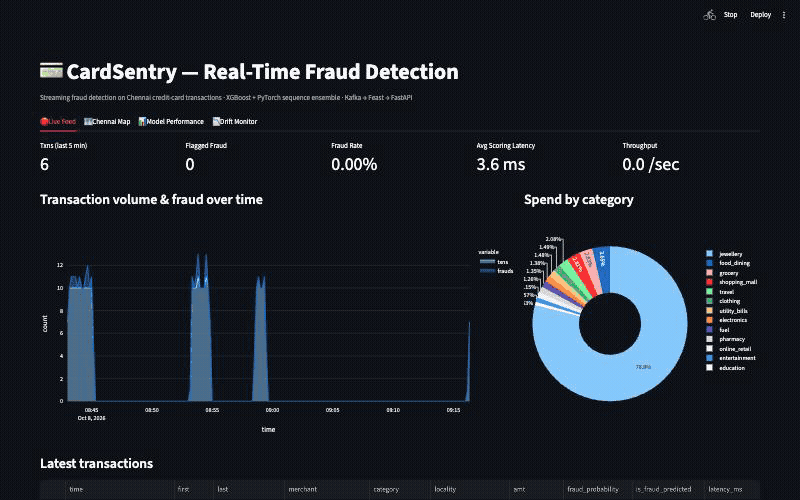

# CardSentry — Real-Time Fraud Detection on Chennai Transactions

A streaming fraud-detection pipeline: synthetic-but-production-scale Chennai
credit-card transactions flow through Kafka, get scored in real time by an
XGBoost + PyTorch sequence-model ensemble, and land on a live Streamlit
dashboard with maps, charts, and drift monitoring.

**Live demo:** _[add your deployed Streamlit Cloud URL here once pushed]_
**Stack:** Python · Kafka (Redpanda) · XGBoost · PyTorch · Feast · MLflow · Evidently · FastAPI · Streamlit · Postgres (Neon)



*Live Feed → Chennai Map → Model Performance → Drift Monitor, captured from the
running app against real Redpanda Kafka + Neon Postgres (not mocked).*

Full data-flow diagram and the "what each stage proves" breakdown: **[docs/architecture.md](docs/architecture.md)**.

---

## Why this project

Card and UPI fraud is not a hypothetical problem to size a portfolio project
around — it's measurably large and measurably growing:

- **Worldwide card fraud losses were $33.41 billion in 2024** (Nilson Report),
  tied to $51.92 trillion in global card volume — roughly 6.4 cents lost per
  $100 spent. ([Nilson Report](https://nilsonreport.com/articles/card-fraud-losses-worldwide-2024/), [StreetInsider](https://www.streetinsider.com/Press+Releases/Global+Card+Fraud+Losses+at+%2433+Billion/25819121.html))
- **In India specifically**, digital payment fraud reported to the RBI jumped
  more than **5x year-over-year** (₹14.57 billion) in FY2024, and UPI fraud
  cases alone rose **85% YoY to 13.42 lakh (1.34 million) cases worth ₹1,087
  crore** in the same period — while over half of fraud victims in one survey
  never even filed a complaint, meaning official numbers understate the
  problem. ([Reuters via Gulf News](https://gulfnews.com/business/banking/online-payment-frauds-jump-over-400-in-india-rbi-data-shows-1.1717079200678), [Moneylife](https://moneylife.in/article/upi-frauds-27-lakh-cases-worth-rs2145-crore-registered-in-30-months-govt/75709.html))
- **The market is responding at pace**: the real-time fraud-monitoring segment
  specifically is forecast to grow from ~$10.6B (2024) to ~$161.4B by 2034
  (31.3% CAGR) — the fastest-growing slice of the broader $39-49B fraud
  detection & prevention market (13-17% CAGR). ([Market.us](https://scoop.market.us/real-time-fraud-monitoring-market-news/), [GlobeNewswire](https://www.globenewswire.com/news-release/2024/04/03/2857133/28124/en/Fraud-Detection-and-Prevention-Global-Strategic-Business-Report-2024-Role-of-Machine-Learning-in-Fraud-Detection-Gaining-Prominence-Market-Forecasts-to-2030.html))

The reason "real-time" specifically matters, not just "fraud detection": a
model that scores a transaction a day later is a reporting tool, not a
defense — the money is already gone. The entire design of this project
(Kafka ingestion, sub-5ms scoring, a feature store to keep training and
serving features identical) exists to take that constraint seriously, the
same way a production fraud team has to.

This is also a deliberate **rebuild** of an earlier project
([J-An-dev/real-time-fraud-detection](https://github.com/J-An-dev/real-time-fraud-detection),
Spark + Cassandra + Spring Boot, Random Forest) — redone with a current MLOps
stack (feature store, experiment tracking, drift monitoring) and personalized
to Chennai, India: synthetic customers, real localities (T Nagar, Anna Nagar,
Velachery, OMR, Mylapore...) and real merchant names (Nalli Silks, Saravana
Stores, GRT Jewellers, Swiggy...) instead of generic placeholder data.

## What was built

- A **Chennai-personalized synthetic data generator** producing 1.53M
  transactions across 5,000 customers, with 5 distinct fraud patterns and
  deliberate realistic noise (see [Model](#model--data-design) below).
- An **XGBoost + PyTorch GRU ensemble**, stacked via logistic regression,
  trained with a chronological split and tracked in **MLflow**.
- A **Feast feature repository** with both offline (point-in-time-correct)
  and online retrieval verified working.
- A **Kafka producer/consumer pair** against a managed, SASL-authenticated
  **Redpanda Serverless** cluster.
- A **FastAPI scoring service** sharing one scoring code path with the Kafka
  consumer — sub-5ms latency per transaction.
- A **Streamlit dashboard** (Live Feed, Chennai Map, Model Performance, Drift
  Monitor) reading from a shared **Postgres (Neon)** store.
- **Evidently drift monitoring**, Docker Compose, GitHub Actions CI, and
  **17 passing tests**.

## How it works

See **[docs/architecture.md](docs/architecture.md)** for the full Mermaid
data-flow diagram tracing one transaction end to end, plus a table mapping
every stage to the specific engineering claim it's meant to prove.

---

## Model & data design

- **XGBoost** on tabular + hand-engineered velocity features (txn count/sum in
  10min/1h/24h windows, time-since-last-txn, distance-from-last-txn).
- **PyTorch GRU** over each card's last 5 transactions, matching the "sequence
  model over recent spend history" from the original project brief.
- **Stacked meta-model** (logistic regression) combines both base models'
  probabilities — fit on held-out *validation* predictions, evaluated on a
  separate, later *test* split.
- Train/val/test splits are **chronological**, not random — fraud detection
  is a forecasting problem, and a random split would leak future information.
- Decision threshold is tuned on the validation set for a target
  false-positive rate (default 1.8%), not just argmax accuracy.

### Making the synthetic data honestly hard

The first version of the generator produced a model with **ROC-AUC 1.000 and
AUC-PR 0.997** — a result that looks great and means the exercise failed: the
fraud patterns were too cleanly separable (mainly because fraud bursts
clustered tightly in time while legitimate transactions almost never did —
the model was essentially just learning "many transactions close together in
time = fraud," a shortcut no real fraud label distribution hands you for
free). The generator was redesigned to inject the things that make real
fraud detection hard:

| Addition | Why it matters |
|---|---|
| **Legit "shopping trip" bursts** — a customer hitting 2-5 merchants within 30-90 minutes | Removes "transactions clustered in time" as a free shortcut — real shopping trips cluster too |
| **Hard-negative legit purchases** — genuine ₹5,000-140,000 buys in jewellery/electronics/travel | Removes "high amount + luxury category" as a free shortcut |
| **"slow_skimming" fraud pattern** — small, ordinary amounts spread over hours | A cautious fraudster doesn't trip velocity features; this pattern is deliberately the hardest to catch and is now the *most common* fraud pattern generated |
| **Label noise** — ~3% of fraud labels flipped to legit, ~0.2% of legit flipped to fraud | Real chargeback/dispute labels are never perfectly clean; a model trained on perfectly clean labels is trained on data that doesn't exist in production |

**Results on the held-out, time-ordered test set** after the redesign (1.53M
transactions, ~1.6% fraud rate, 5 fraud patterns):

| Metric | Before (too clean) | After (realistic) |
|---|---|---|
| AUC-PR | 0.997 | **0.757** |
| ROC-AUC | 1.000 | **0.917** |
| Precision | 0.852 | **0.413** |
| Recall | 0.997 | **0.800** |
| F1 | 0.919 | **0.545** |
| False Positive Rate | 0.23% | **1.75%** |
| Avg scoring latency | ~1.15ms | **~1.04ms** |

(current numbers always in `models/artifacts/metadata.json` and the dashboard's
Model Performance tab — rerun `python data_gen/generate.py && python models/train.py`
to regenerate.) Precision in the 30-50% range at high recall is typical for
real fraud systems: most flagged transactions get a second look (manual
review, OTP step-up) rather than an automatic block, so recall matters more
than precision in this threshold regime.

## Feature store (Feast)

`features/engineer.py` is the single source of truth for feature logic,
shared by:
- **Offline training** (`models/train.py` calls it directly on the full batch)
- **Feast** (`feature_repo/`) — the same engineered features are registered
  as a `FeatureView`, retrievable two ways (`features/feast_demo.py`):
  `get_historical_features()` (point-in-time-correct training sets) and
  `get_online_features()` (low-latency lookups after `feast materialize`).
- **Real-time scoring** (`api/card_state.py`) — a lightweight in-memory/SQL
  rolling store recomputing the *same* velocity-feature formulas per card as
  new transactions arrive, so there's never a train/serve feature mismatch.
  This is the hot path for the FastAPI service and Kafka consumer; it's
  deliberately simpler than a live Feast-Redis round trip to keep scoring in
  the single-digit milliseconds (see [Tradeoffs](#tradeoffs--things-i-would-do-differently-with-more-time)).

## Drift monitoring (Evidently)

`monitoring/drift.py` compares the training reference window against either
the most recent live-scored transactions (once enough have accumulated with
enough overlapping features) or a held-out split, rendering both a JSON
summary and a full interactive Evidently report, surfaced in the dashboard's
Drift Monitor tab.

## Experiment tracking (MLflow)

Every `models/train.py` run logs params, metrics (AUC-PR, ROC-AUC,
precision/recall/F1, FPR, scoring latency), and artifacts (PR curve,
confusion matrix, metadata.json) to a local SQLite-backed MLflow store.
Run `mlflow ui --backend-store-uri sqlite:///mlflow.db` to browse runs.

---

## Tech stack & major decisions

| Choice | Alternative considered | Why this one |
|---|---|---|
| **Redpanda Serverless** for Kafka | Confluent Cloud, self-hosted Kafka | Kafka-API-compatible, genuinely free tier (no card required at signup), resume-recognizable as "Kafka-compatible streaming" |
| **Neon** for Postgres | Supabase, self-hosted, SQLite-only | Free serverless Postgres, scales to zero, gives the API/dashboard/consumer a real shared-state store across processes instead of per-process SQLite files |
| **Upstash** for Redis | Self-hosted Redis, ElastiCache | Free serverless Redis, the standard pairing with Feast's `online_store: redis` config |
| **Streamlit** for the dashboard | Next.js + charting lib, Grafana | Built specifically for exactly this (data-app with live Python backend); a Grafana setup would need its own time-series DB and config layer for no real benefit here |
| **FastAPI** for scoring | Flask, Django REST | Async-native, automatic OpenAPI docs, Pydantic validation — appropriate for a low-latency scoring endpoint |
| **XGBoost + PyTorch, stacked** (not one model) | XGBoost alone | Matches the project brief's explicit claim of pairing a tabular baseline with a sequence model; stacking (not just averaging) lets the meta-model learn when to trust which base model |
| **Chronological split** (not random) | Random train/test split | A random split would let the model "see the future" during training — fraud detection is fundamentally a forecasting problem |
| **SQLite by default, Postgres via env var** | Postgres-only | Keeps local dev/CI friction-free (no DB server needed to run tests) while being a one-line change for the real deployment |
| **Docker for the whole app, not the dev machine's Python** | Pin exact versions on host | The dev machine runs Python 3.14 (very new; several ML libraries needed workarounds — see below); Docker images pin Python 3.11-slim so the deployed/CI environment is unaffected by host quirks |

## Tradeoffs — things I would do differently with more time

Being explicit about this is part of the exercise:

- **Feast online store is not in the hot path.** The real-time scorer uses a
  custom in-memory/SQL rolling store instead of a live `get_online_features()`
  call to Feast's Redis backend. A genuine Feast online round-trip adds
  network latency that risks the sub-5ms target, and wiring + load-testing
  that path reliably needed more time than a one-day build allowed. The Feast
  repo and both retrieval paths are real and demonstrated
  (`features/feast_demo.py`); swapping the online store in is a config change
  (`feature_repo/feature_store.yaml`) plus a scorer rewrite, not a redesign.
- **Data is synthetic, not real.** Clearly labeled as such throughout. Real
  transaction data (e.g., IEEE-CIS, Kaggle's credit card fraud dataset) would
  carry more credibility with a technical reviewer but comes with licensing
  and realism-of-a-different-kind tradeoffs (anonymized/PCA-transformed
  features that can't be meaningfully feature-engineered further). Synthetic
  data traded that for control over fraud-pattern realism and the ability to
  demonstrate fixing a too-easy dataset (see the debugging journal below).
- **Single-node Kafka semantics, not a cluster.** Redpanda Serverless is a
  managed single-tenant cluster; there's no multi-broker failover story
  demonstrated here, because demonstrating it meaningfully needs a cluster to
  kill, which a free tier doesn't give you.
- **No model monitoring beyond drift.** Evidently covers input-distribution
  drift; it doesn't cover prediction-quality monitoring against ground-truth
  outcomes (which in a real system arrives on a delay, as chargebacks post).
  That delayed-feedback-loop problem is real in production fraud systems and
  isn't modeled here.
- **Threshold is global, not per-segment.** A real system would likely tune
  decision thresholds per merchant category or customer risk tier; this
  project tunes one threshold for a target false-positive rate across the
  whole population.

## Debugging journal — what actually broke during the build

Kept honest because "it worked the first time" is rarely true and isn't
useful to anyone reading this as a reference:

| Bug | Symptom | Root cause | Fix |
|---|---|---|---|
| **Silent `unix_time` corruption** | Velocity features (`txn_count_1h`, etc.) all looked wrong — e.g. `txn_count_1h` exactly equal to `txn_count_24h` | `trans_time.astype("int64") // 10**9` assumed nanosecond-precision datetime64, but this pandas version stores datetime64 in **microseconds** — the divide was off by 1000x, producing a bogus 1970-epoch timestamp | `trans_time.values.astype("datetime64[s]").astype("int64")` — explicit unit conversion instead of assuming the internal representation |
| **Segfault (exit 139) loading XGBoost + PyTorch together** | Training crashed with no Python traceback, just `Fatal Python error: Segmentation fault` | Both libraries link OpenMP (`libomp.dylib` on macOS); loading both in one process with XGBoost's `n_jobs=-1` caused a thread-init collision | `OMP_NUM_THREADS=1`, `KMP_DUPLICATE_LIB_OK=TRUE`, and capping XGBoost's `n_jobs` to a fixed number instead of `-1` |
| **MLflow `filestore is in maintenance mode` error** | `mlflow.set_experiment()` raised on first run | MLflow 3.x deprecated the plain filesystem tracking backend | Switched tracking URI to `sqlite:///mlflow.db` |
| **Evidently API totally different from what was written** | `ModuleNotFoundError: No module named 'evidently.report'` | Evidently 0.7 (installed) replaced the entire 0.4-era `Report`/`metric_preset` API used while writing the first draft | Rewrote `monitoring/drift.py` against the current `evidently.Report` / `evidently.presets` / `Dataset.from_pandas()` API |
| **Pydeck map crashed with a JS parse error** | `Error: Unclosed [ at character 46` rendered in the Chennai Map tab | Passed a Python-conditional-style string (`"[255,0,0] if x else [0,0,255]"`) as a deck.gl accessor — deck.gl doesn't evaluate Python expressions | Precompute a `color` column in pandas first, reference it by name in the pydeck layer |
| **`cust.first` silently returned a method, not the column** | `TypeError: Object of type method is not JSON serializable` when posting simulated transactions | `pandas.Series` has a built-in `.first` method (inherited from `NDFrame`); attribute access on a column literally named `first` returns the method, not the value, with no warning | Use `cust["first"]` (bracket access) instead of `cust.first` everywhere a column name collides with a pandas built-in |
| **Chennai Map tab empty despite data existing** | Dashboard showed "lat/long not present" even after transactions had geo data | Two bugs stacked: the DB schema didn't persist `merch_lat`/`merch_long` at all, and the dashboard's presence check looked for a column named `lat` that was never going to exist | Added the columns to the store schema and fixed the check to look for `merch_lat` |
| **Drift report showed only 2 of 13 features** | `n_columns: 2` in the drift summary, not meaningfully comparable | Live-scored transactions persisted to the DB only carry the raw fields the API receives, not the full engineered feature set used in training | Added a fallback: use live data for drift comparison only if it has ≥500 rows *and* ≥5 overlapping engineered columns, else fall back to a held-out training split |
| **Redpanda SASL handshake failed** | `Unsupported SASL mechanism: broker's supported mechanisms: SCRAM-SHA-256,SCRAM-SHA-512,OAUTHBEARER` | Code defaulted to `PLAIN`, which Redpanda Serverless doesn't offer | Switched to `SCRAM-SHA-256` |
| **Kafka consumer group authorization failed** | Producer could write to the topic; consumer got `GROUP_AUTHORIZATION_FAILED` | Redpanda's ACLs for the generated credential covered the topic but not consumer-group membership — these are granted separately | Granted read/describe ACLs on the consumer group via the Redpanda console (a manual step, documented for anyone redeploying this) |
| **Model achieved ROC-AUC 1.000** | Technically a "pass," but a reviewer would (correctly) read it as a leaky or trivial dataset | Fraud bursts clustered tightly in time while legit transactions almost never did — the model learned a shortcut, not fraud detection | See [Making the synthetic data honestly hard](#making-the-synthetic-data-honestly-hard) above — redesigned the generator rather than declaring victory |

---

## Project layout

```
cardsentry/
├── data_gen/          Chennai-personalized synthetic data generator
├── features/          Shared feature engineering + Feast demo
├── feature_repo/      Feast feature definitions (feature_store.yaml, definitions.py)
├── models/            Training (XGBoost + PyTorch GRU + stacking), MLflow logging
├── api/               FastAPI scoring service, shared scorer, shared store
├── streaming/         Kafka producer + consumer
├── monitoring/        Evidently drift monitoring
├── dashboard/         Streamlit live dashboard
├── scripts/           Local traffic simulator (no Kafka needed)
├── tests/             pytest suite (data gen, features, scorer, API)
├── docs/              Architecture + data-flow diagram
└── docker-compose.yml Full local stack incl. single-node Redpanda
```

## Running it

### 1. Setup

```bash
python3 -m venv .venv && source .venv/bin/activate
pip install -r requirements.txt
brew install libomp   # macOS only — required by XGBoost
```

> **Note on OpenMP:** loading both PyTorch and XGBoost in the same process can
> segfault on macOS unless `OMP_NUM_THREADS=1` and `KMP_DUPLICATE_LIB_OK=TRUE`
> are set — already handled inside `models/train.py` and `api/scorer.py`, but
> set them in your shell too if you run things manually (see the debugging
> journal above for why).

### 2. Generate data and train

```bash
python data_gen/generate.py --customers 5000 --transactions 1500000   # ~10s, ~115MB
python models/train.py                                                 # ~45s
python monitoring/drift.py                                             # optional
python features/feast_demo.py                                          # optional, needs `feast` CLI
```

### 3. Run locally (no Kafka needed — quickest way to see it working)

```bash
uvicorn api.main:app --port 8000 &
streamlit run dashboard/app.py
python scripts/simulate_live_traffic.py --n 500 --fraud-ratio 0.03 --delay 0.03
```
Open http://localhost:8501 — the Live Feed tab updates every 5 seconds.

### 4. Run the full streaming stack locally with Docker

```bash
docker compose up --build
```
Starts a local Redpanda broker + API + dashboard + producer + consumer together.

### 5. Point at free-tier managed services (for the live deployment)

Copy `.env.example` to `.env` and fill in:
- `KAFKA_BOOTSTRAP_SERVERS` / `KAFKA_API_KEY` / `KAFKA_API_SECRET` — Redpanda Serverless (SCRAM-SHA-256; also grant consumer-group ACLs, not just topic ACLs — see debugging journal)
- `DATABASE_URL` — Neon Postgres (shared store for API + dashboard across processes)
- `FEAST_REDIS_URL` — Upstash Redis (if using Feast's online store directly)

### 6. Tests

```bash
pytest tests/ -v
```
17 tests covering data generation sanity, feature engineering correctness
(velocity windows, sequence construction, no leakage before a card's first
transaction), scorer behavior (fraud-pattern transactions score higher,
latency bound), and the FastAPI endpoints. CI runs these on every push.

---

## What's real vs. simplified (for anyone reviewing this)

- **Real:** XGBoost + PyTorch ensemble trained on 1.53M rows with
  chronological splits and deliberately realistic noise, MLflow experiment
  tracking, Evidently drift detection, a working Feast feature repo with both
  offline and online retrieval, a Kafka producer/consumer against a managed
  SASL-authenticated cluster, a FastAPI scoring service, a Streamlit
  dashboard, Docker Compose, CI, 17 passing tests — all verified running
  end-to-end against the real managed services (Redpanda, Neon), not just
  localhost.
- **Simplified for a short build cycle:** the hot real-time scoring path uses
  a lightweight in-process/SQL feature store instead of a live Feast-Redis
  round trip (documented above, and swappable); the data is synthetic
  (clearly labeled, never presented as real transactions); see
  [Tradeoffs](#tradeoffs--things-i-would-do-differently-with-more-time) for
  the full list.

## License

MIT
