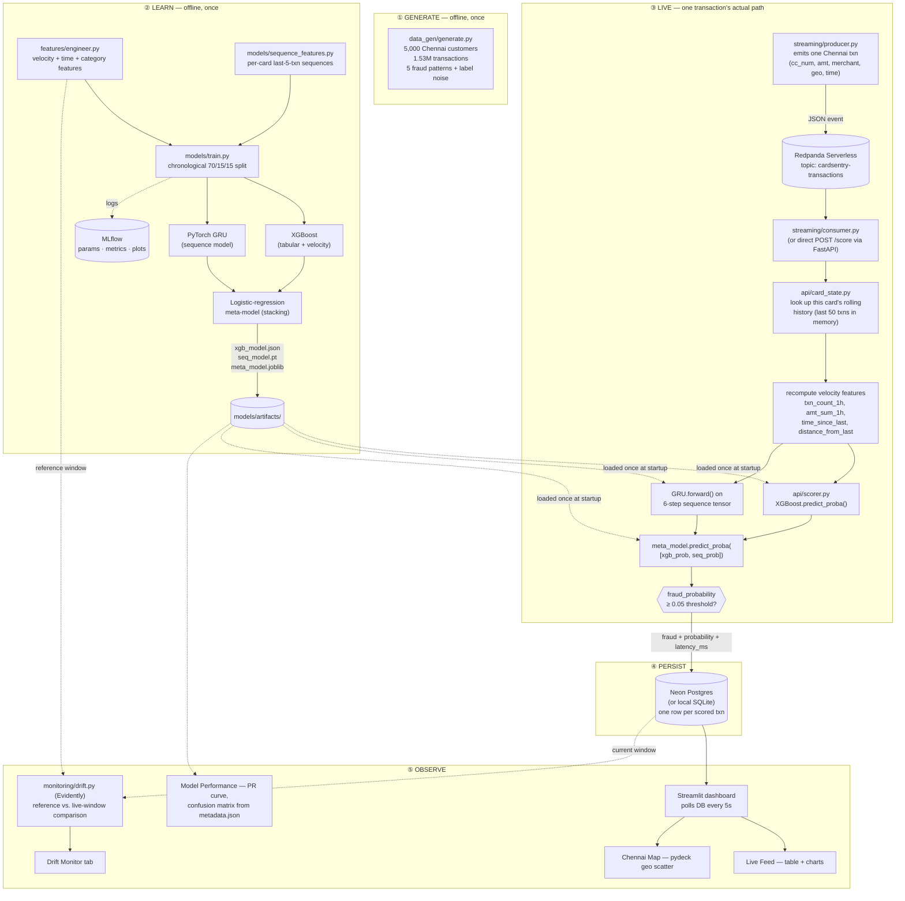

# CardSentry — Architecture & Data Flow

## 1. End-to-end data flow (what actually happens to one transaction)

**Timing, measured on this build:** generation ~10s for 1.53M rows · training ~45s for
both models · scoring ~1-4ms per transaction end-to-end (feature lookup + XGBoost +
GRU + meta-model) · dashboard refresh every 5s.

---

## 2. What each stage is built to prove

This project exists to demonstrate specific, checkable engineering claims — not just
to produce a dashboard. Each stage below maps to a claim a reviewer can verify by
reading the code or running it themselves.

| Stage | Claim being proven | How to verify it yourself |
|---|---|---|
| **Data generation** | Can design a labeled dataset at real scale (1.5M+ rows) with *intentional* class imbalance and *intentional* label noise, not just call `make_classification()` | `python data_gen/generate.py` — read the fraud pattern mix printed at the end |
| **Feature engineering** | Understands train/serve skew and designs against it — one module (`features/engineer.py`) is imported by both the training script and (indirectly, via identical formulas) the real-time scorer | `tests/test_features.py` — velocity window tests, no-leakage-before-first-transaction test |
| **Chronological split** | Understands that fraud detection is a forecasting problem — a random train/test split would leak future information | `models/train.py::temporal_split` — train/val/test are time-ordered slices, never shuffled |
| **Two-model ensemble** | Can combine a tabular model (XGBoost) with a sequence model (PyTorch GRU) via stacking, not just pick one | `models/train.py` — meta-model is fit on *held-out validation* predictions, evaluated on a separate test split |
| **Realistic metrics** | Recognizes when a model result (ROC-AUC 1.000) is a red flag rather than a win, and can diagnose + fix the data generation to produce defensible numbers | See the "Debugging journal" in the main README — this was an actual mid-build correction |
| **MLflow tracking** | Treats every training run as reproducible, logged, comparable — not a notebook that got lucky once | `mlflow ui --backend-store-uri sqlite:///mlflow.db` after running `train.py` twice |
| **Feast feature store** | Can wire up a real feature store with both offline (point-in-time-correct) and online retrieval paths, understands why that matters | `python features/feast_demo.py` — runs `feast apply`, `feast materialize-incremental`, then both retrieval calls |
| **Kafka streaming** | Can build a real producer/consumer pair against a managed, SASL-authenticated Kafka cluster — not just `localhost:9092` with no auth | `streaming/producer.py` + `streaming/consumer.py` against Redpanda Serverless (see README for the SASL/ACL debugging story) |
| **Sub-5ms scoring** | The model is actually fast enough to sit in a request path, not just accurate in a notebook | `models/artifacts/metadata.json::avg_scoring_latency_ms` — measured on 500 held-out rows, end to end |
| **Drift monitoring** | Understands that a deployed model's input distribution can shift, and has instrumented a way to detect it before accuracy silently degrades | `monitoring/drift.py` — Evidently `DataDriftPreset` report, JSON summary consumed by the dashboard |
| **Shared state across processes** | The API (writer), Kafka consumer (writer) and Streamlit dashboard (reader) all see one consistent view of live data, swappable from SQLite to managed Postgres with one env var | `api/store.py` — same code path, `DATABASE_URL` picks the backend |
| **Testing discipline** | Business logic is covered by tests that would actually catch a regression, not placeholder tests | `tests/` — 17 tests across data generation, feature correctness, scorer behavior, API contracts; CI runs them on every push |
| **Free-tier cloud deployment** | Can design within real constraints (no budget) instead of defaulting to "just use AWS" | Redpanda Serverless (Kafka) + Neon (Postgres) + Streamlit Community Cloud / Render — all free tier, documented in README |

---

## 3. Why a hybrid architecture, not a straight port

The original project (Spark + Cassandra + Spring Boot) and this one solve the same
problem — classify a transaction in flight — but the shape of the solution differs
because the constraint differs:

| | Original | CardSentry | Why |
|---|---|---|---|
| Stream processing | Spark Structured Streaming | Python Kafka consumer + FastAPI | Spark needs a cluster (JVM, executors, shuffle) to earn its keep; at this throughput a single Python process is simpler to run, debug, and deploy free-tier, with no loss of correctness |
| Storage | Cassandra | Postgres (Neon) / SQLite | Cassandra's write-optimized wide-column model pays off at a scale this project doesn't reach; Postgres gives the same "any process can read the latest state" property with far less operational weight |
| Dashboard | Spring Boot + JSP | Streamlit | Spring Boot's strength is a durable multi-page web app; a live metrics dashboard is exactly Streamlit's design target, in a fraction of the code |
| ML | Random Forest (Spark MLlib) | XGBoost + PyTorch GRU, stacked | Matches the brief's claim of pairing a tabular baseline with a sequence model over recent spend history — Spark MLlib doesn't have a sequence-model story |

This is the central engineering judgment call of the project: **match the tool to the
actual load, not to what sounds impressive.** 1,500 events/sec sustained does not
need a Spark cluster; it needs a process that doesn't block.
